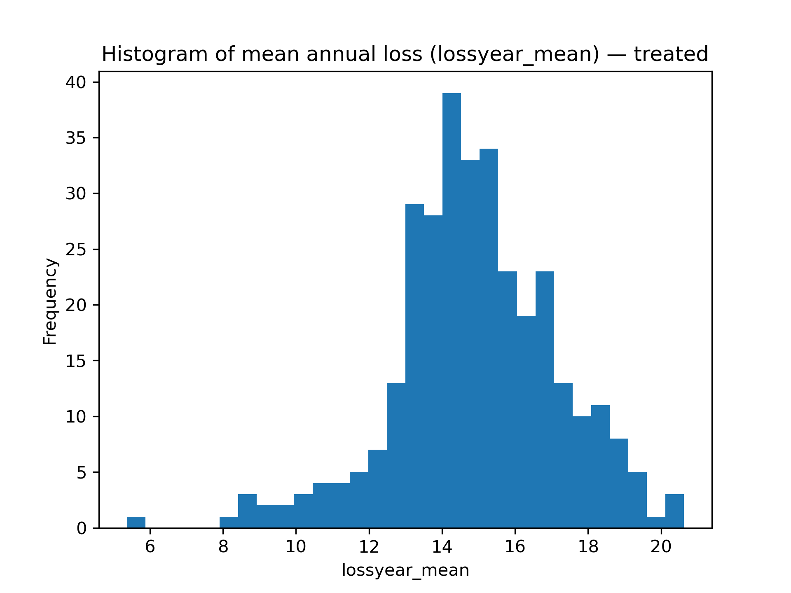
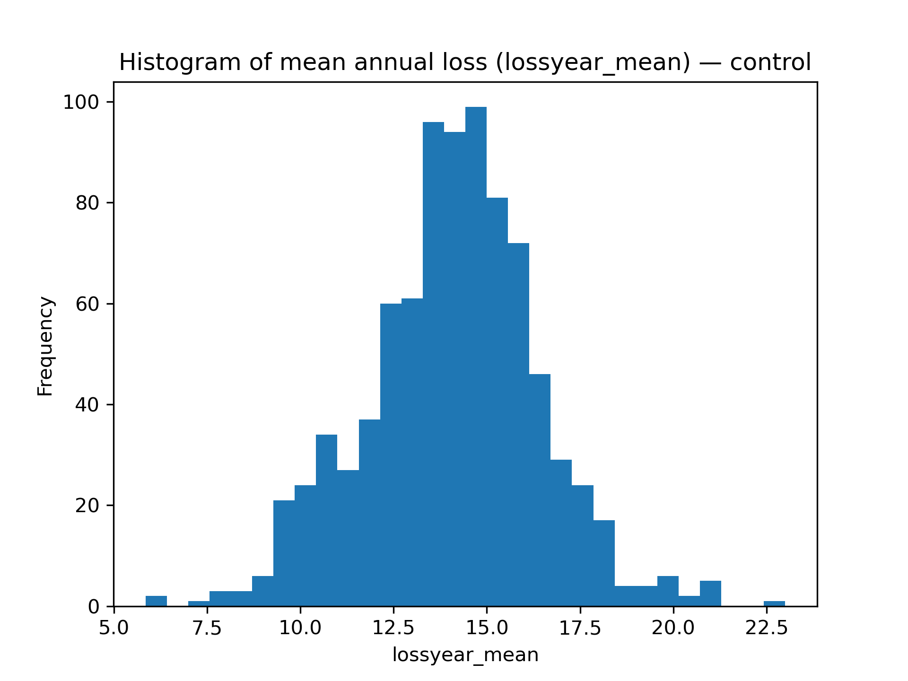
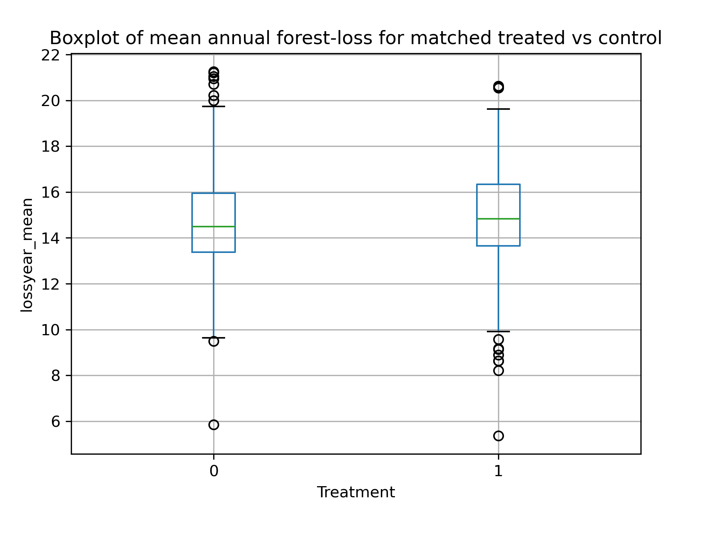
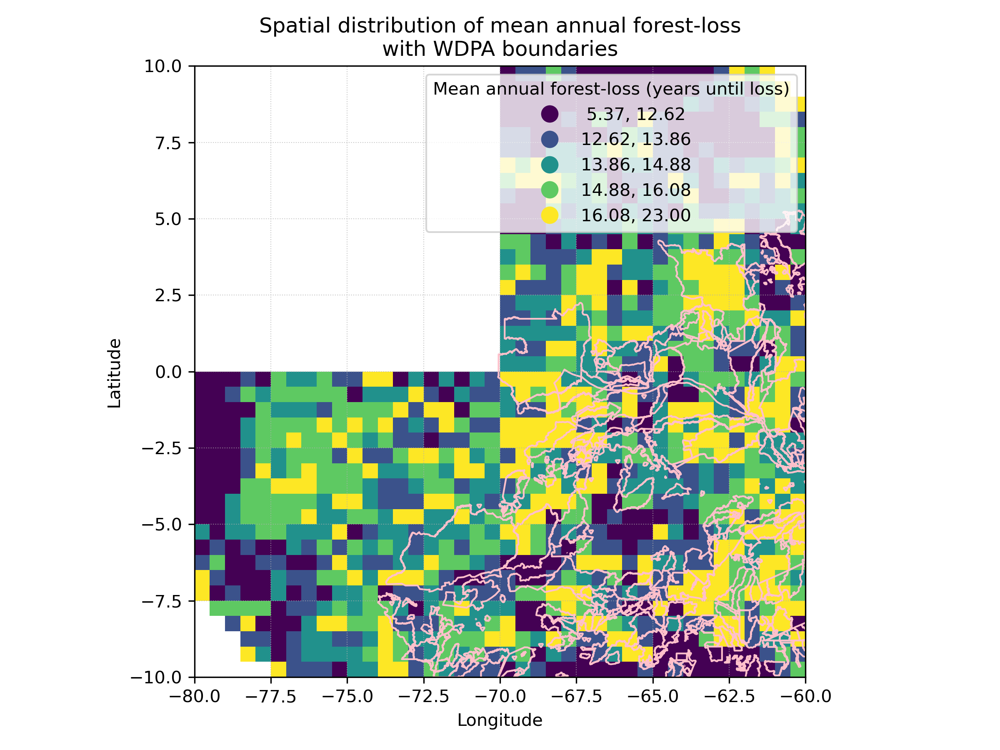

# Deforestation & Protected Areas — a causal study

This project estimates the causal impact of protected-area (PA) designation on forest loss. It builds a regular grid, assembles covariates (population, roads, canopy, access), matches protected cells to comparable controls using propensity scores, and reports the ATT with robust inference.

**Read the paper:** [`reports/paper/Final_Report.pdf`](reports/paper/Final_Report.pdf)

---

## Why this matters
Protected areas are a central conservation tool, but they aren’t placed at random. Sites differ in access, population pressure, and baseline forest conditions. Naïve comparisons can mislead. Propensity-score matching creates comparable treatment and control sets so we can discuss policy impact with fewer confounders and more transparency.

---

## What’s inside
- **Reproducible spatial grid:** WDPA + Hansen GFC + OSM + SEDAC/GPW → cell-level features  
- **Propensity matching:** logistic scores, common-support trimming, calipered nearest neighbor  
- **Inference:** permutation tests, bootstrap CIs, Rosenbaum sensitivity  
- **Figures:** distribution plots and a study-area map

---

## Quickstart

**1) Environment (Python 3.10+)**

    python -m venv .venv
    # Windows
    . .venv/Scripts/activate
    # macOS/Linux
    # source .venv/bin/activate

    pip install -U pip
    pip install -e .

**2) Download Dataset**

    python scripts/download_hansen_data.py
    python scripts/load_wdpa.py
    python scripts/download_osm_data.py
    python scripts/load_population.py
    python scripts/load_roads.py

**3) Build features and grid**

    python scripts/preprocess_data.py
    python scripts/mosaic_hansen.py
    python scripts/generate_map_grid_wdpa.py

**4) Match, infer, and generate figures**

    # CLI with packaged pipeline
    deforestation match data/processed/grid_stats_with_protection.geojson \
        --covariate pop_density \
        --covariate road_dist \
        --caliper 0.1 \
        --output-dir reports/matching

    # Or run the original GeoPandas workflow (writes GeoJSON + CSV outputs)
    python scripts/propensity_matching.py --caliper 0.10 --output-dir reports/matching
    python scripts/advanced_inference.py
    python scripts/generate_figures.py

> The repo includes a small demo/sample route so you can run end-to-end in minutes. For full analysis, point scripts to your local WDPA/GFC/OSM/SEDAC paths.

---

## Testing

Run the synthetic test-suite to verify the matching utilities and ensure regressions are caught early.

    pytest

---

## Results (demo subset)

  
  
  

Study area and grid overlay:

  

*See the paper for full-scale estimates, confidence intervals, balance diagnostics, and sensitivity analysis.*

---

## How the code is organized

    .
    ├─ scripts/
    │  ├─ download_hansen_data.py         # GFC tiles (sample/full)
    │  ├─ download_osm_data.py            # roads via OSM
    │  ├─ load_wdpa.py                    # protected areas
    │  ├─ load_population.py              # SEDAC/GPW
    │  ├─ preprocess_data.py              # cleaning + joins
    │  ├─ mosaic_hansen.py                # raster mosaics + zonal stats
    │  ├─ generate_map_grid_wdpa.py       # grid + overlays
    │  ├─ propensity_matching.py          # scores, trimming, matching
    │  ├─ improved_propensity_matching.py # variants/balance checks
    │  ├─ advanced_inference.py           # permutation, bootstrap, bounds
    │  └─ generate_figures.py             # plots
    ├─ data/
    │  └─ sample/                         # tiny inputs for the demo
    ├─ reports/
    │  ├─ figures/                        # output plots
    │  └─ paper/Final_Report.pdf          # methods + results
    └─ assets/                            # (optional) diagram/gif

---

## Assumptions & limits
- Unconfoundedness on observed covariates; sensitivity analysis probes remaining bias.  
- Cell area varies with latitude; an equal-area grid is a sensible next step.  
- The demo subset is for reproducibility; use full tiles for inference with power.

---

## Data sources & licenses
- **WDPA** (protected areas), **Hansen GFC** (forest change), **OSM** (roads), **SEDAC/GPW** (population).  
Each has its own license—respect upstream terms for non-demo runs.

---

## About
I’m Advait (Duke ’27). I like turning environmental data into tools and evidence that move decisions.  
**Contact:** advait.bhaskarpandit@duke.edu · GitHub @AdvaitBP
